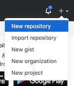
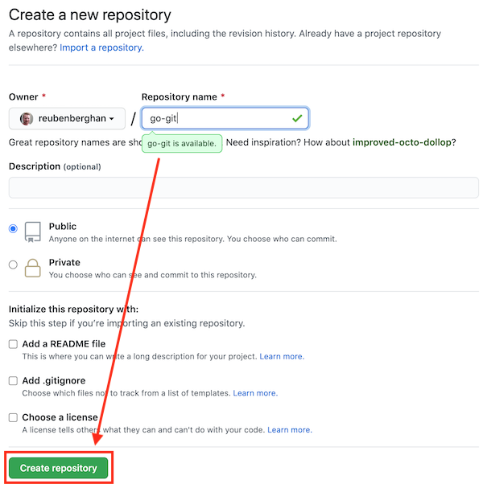
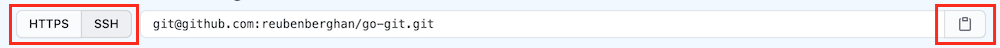

# Get going with `git`

Setup prerequisites:
- install Homebrew
- install git
- setup ssh keys

Just skip over anything that is already setup :)

### Homebrew

Is a package manager for mac. This will be useful for much more than just adding git but for now it is good to know that you can add and manage a bunch of dev tools using Homebrew. Find out more at [https://brew.sh/](https://brew.sh/)

To install run the following in a terminal
```bash
/bin/bash -c "$(curl -fsSL https://raw.githubusercontent.com/Homebrew/install/master/install.sh)"
```

### `git`

In a terminal run the following:
```bash
brew install git
```

### ssh keys

In order for your local git repositories to be authenticated with GitHub you'll want to setup an ssh key so that you don't have to enter your GitHub credentials every time you want to pull or push code.

To generate a new ssh key follow [these instructions on generating a new key](https://docs.github.com/en/github/authenticating-to-github/generating-a-new-ssh-key-and-adding-it-to-the-ssh-agent#generating-a-new-ssh-key). Once you've generated your key and added it to the ssh-agent then you can [add the key to your GitHub account](https://docs.github.com/en/github/authenticating-to-github/adding-a-new-ssh-key-to-your-github-account).

> **NOTE** adding a passphrase to the key is optional, and officially probably a good idea, but you can leave empty for no passphrase by just pressing return. 

> **NOTE** if something goes wrong with this part don't worry you can still interact with GitHub without this key set up it's just a bit easier when it is.

## GitHub and `git`

Now that you've got the tools and auth set up the next thing to do is to create a repo on GitHub and get familiar with the basics of git like:
- cloning `git clone`
- initialising `git init`
- setting up a remote `git remote add` (and checking your remotes)
- adding `git add`
- committing `git commit`
- pushing `git push`
- pulling `git pull`
- branching `git branch`

The other two pieces to know at the start are adding and committing files.

### Create a repo on GitHub

1. Log into GitHub and add a new repo from the `+` in the top right of the UI.



2. Add a repo name and then click `Create repository`. 

> **NOTE** it's standard practice that name the of repo is the same as the project (root directory the project files are stored in).



### `git init`

Now there is a repo on GitHub we want to connect that to our existing local project (or if you're starting from scratch then clone this remote repo locally). So navigate to the root of the project in your terminal and initialise `git` in the project by running the following command:

```bash
git init
```

You should see something like this in you terminal: `Initialized empty Git repository in /path/to/your/repo/.git/`

> **NOTE** if the code is already been initialised with git then this step can be skipped.

### `git add`

The next useful command we need to know is to be able to add (stage) files (newly created and existing ones we have modified) to be ready for committing. To add all files to be staged for the next commit run the following in the terminal:

```bash
git add -A
```

With `git add` you can add files to staging explicitly (`git add path/to/file.ext`) or using the `-A` flag (as above) to include everything that is new or modified.

> **NOTE** a useful git command, `git status`, can be run at any time in the terminal to see what the status of your files are with git the command output also makes use of colour in the terminal to indicate whether files are staged or not. Basically if it's green it'll be included when `git commit` is run if it is red then it won't.

### `git commit`

Talking about committing generally that is the next command to run after a `git add`. Do double check by running `git status` that all files you want to include are going to be included (listed under "Changes to be committed" and are in green). If you are all good then you can run:

```bash
git commit -m "Initial commit"
```

The `-m` flag allows us to add a commit message which we've put in the apostrophes. The message here "Initial commit" is a pretty standard first commit in most repos but you can add whatever is relevant to the files / changes that are included in the commit.

### `git remote add`

This only needs to be done on a project that was started (`git init`'d) locally or you want to add multiple remotes (but we don't need to worry about that now). This is a command you'll generally only need once per project so just run the following:

```bash
git remote add origin <URL of your remote repo>
```

Just to pick this apart a little more `origin` is the local name of the remote and is a pretty standard name for your GitHub remote. You'll need to replace the `<URL of your remote repo>` with either the SSH or HTTPS URL of your remote (if your ssh keys are setup use the SSH one).

In the GitHub once you've created you new repo you should see the below UI with your GitHub remote URL. On the left are the options to select either the HTTPS or SSH URL and the button on the left copies this to the clipboard.



> **NOTE** to see your current remote(s) for a project locally run `git remote -v`.

### `git push`

Now that git is initialised, there is a commit, and the remote has been added we can push our code to the remote. Running the following command in the terminal will push the latest from the local to the remote copies of our project:

```bash
git push -u origin master
```

To break what is going on in this command down a little more. The use of `origin` is to say which remote we are wanting to push to and `master` is the branch we are pushing to that remote. The `-u` flag just allows for tracking of this branch with that remote. This is just basically setting the default origin for this branch so now git will know where to `push` to (and also `pull`) from when you're on this branch.

So once you've told git the default remote to track this branch you only need to run `git push` to push any changes to the remote (GitHub in our case so far).

### `git branch`

Branches in git are a way to manage making changes to the code while still ensuring we don't mess up our nice clean `master` branch.

A pretty standard dev workflow could be:
1. We want to add this thing
1. We create a branch off of our master branch
a. `git checkout master`
b. `git branch my-cool-new-thing`
c. `git checkout my-cool-new-thing` (hot tip, you can combine `git branch` and `git checkout` with `git checkout -b my-cool-new-thing`)
1. We make the changes
a. Edit / add files
b. `git add -A`
c. `git commit -m "add cool new thing"`
1. We push the changes
a. `git push -u origin my-cool-new-thing`
1. We merge the changes
a. Create a PR into the `master` branch in GitHub
b. Review the code, make any necessary changes, and then merge the PR
1. Pull down the latest into `master`
a. `git checkout master`
b. `git pull` (because we used the `-u` flag when we created the branch on our first push git knows where we want to pull from here)
1. Rinse and repeat
a. At some point you will likely want to clean up merged branches but let's get out head around these steps first

So there is a bit going on in that workflow but basically the main commands for branches are:
- List local branches: `git branch`
- List remote branches: `git branch -r`
- Create a new branch: `git branch branch-name`
  - To create and move to the new branch in one: `git checkout -b branch-name`
- Delete a local branch: `git branch -D branch-name`
  - **NOTE** the `-D` is a force delete but this is something that can be discussed later.

### `git pull`

This is the command to run when you want to pull down the latest code from the remote. When you are working with others on a project this is useful to pull down code someone else has pushed to the remote. For personal projects where you are the only person making changes you may only need this command when you merge branches into master in GitHub and want to make sure your local master branch is up to date.

This command is actually a combination of sequentially running two other git commands `git fetch` and `git merge` (which effectively does what it sounds like they are doing). But is something to dive into further down the line.

### Other useful git commands

Coming in a second...